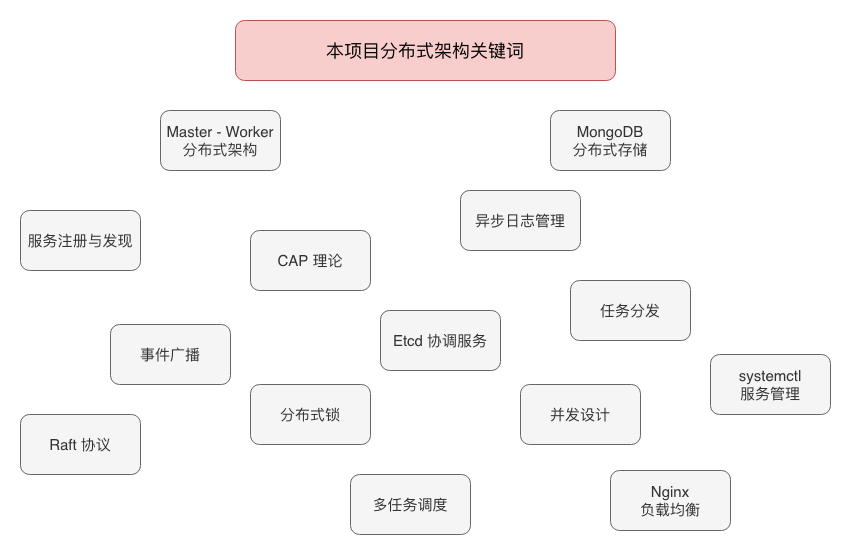
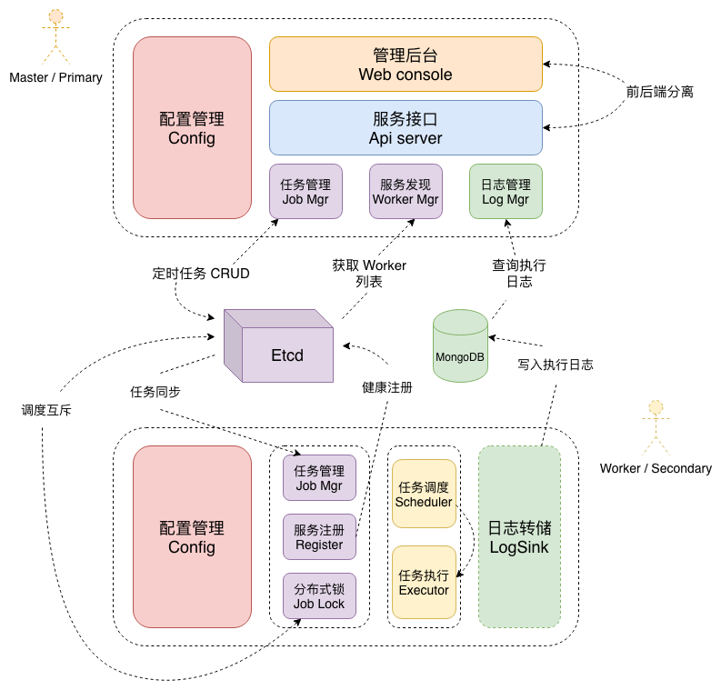
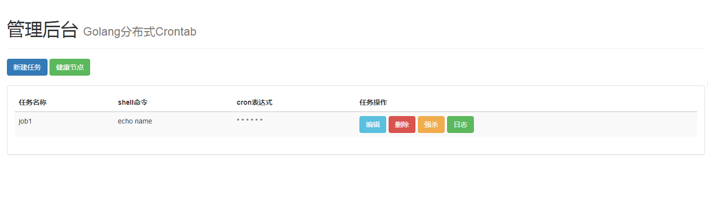

# Cronitor

🗃️ Golang implemented Distributed Task Scheduler with Web UI Tool for High-performance Crontab

## Overview

<div align="center">
  
</div>


## Tech Stack

Golang as main developing language, MongoDB as the database to store logs, Etcd as the distributed key-value store to save cron jobs in the backend

<div align="center">
  
</div>

## Usage

```sh
# master
$ go build master.go

# worker
$ go build worker.go
```

## Demo

<div align="center">
  
</div>
